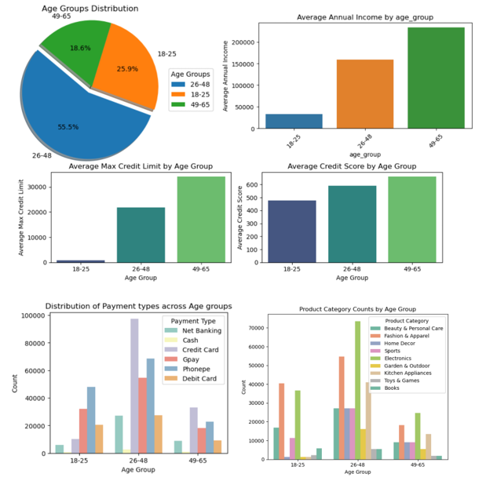

# AtliQo_credit_card
## Project Overview

This project analyzes bank customer data to identify potential customers who are most likely to be approved for a new credit card. The goal is to help the bank target the right audience, maximize profits, and reduce risk by using data-driven decision-making.

 ## Objectives

Analyze customer demographics and financial details.

Build a predictive machine learning model to classify potential customers.

Provide insights to support marketing and business strategies.

## Technologies & Tools Used

Programming Language: Python
Libraries: Pandas, NumPy, Matplotlib, Seaborn, Scikit-learn

Techniques: Data Cleaning, Exploratory Data Analysis (EDA), Feature Engineering,   Classification Models

version Control: Git/GitHub

# Features: Age, Gender, Income, Credit Score, etc.

Target: Customer approval likelihood for a new credit card.

## Project Workflow

Data Preprocessing: Cleaning missing values, encoding categorical variables, scaling.

EDA: Visualizing customer demographics and behavior.

Insights: Key factors influencing customer approval.

Results & Insights

1. People with age group of 18 -25 accounts to ~26% of customer base in the data
2. Avg annual income of this group is less than 50k
3. They don't have much credit history which is getting reflected in their credit score and credit limit 
4. Usage of credit cards as payment type is relatively low compared to other groups
5. Top 3 most shopping products categories : Electronics, Fashion & Apparel, Beauty & Personal care
